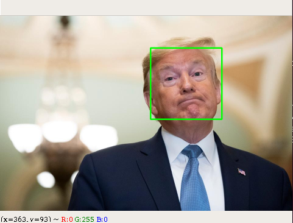

# openCvFaceDetection

This is face detection bot . You can detect faces on an image and also by opening you web cam.

<h3>Environment Setup</h3>
<ol>
  <li>Install python 3.6 or above</li>
  <li>Install OpenCv latest version</li>
</ol>

Thats it , you dont need anything else

<h3>Running the files:-</h3>

There are two python files in the folder one is main.py and the other is video.py

main.py deals with detecting faces on a picture

</img>

video.py deals with detecting faces on video or by opening your webcam

Happy Face Detecting

